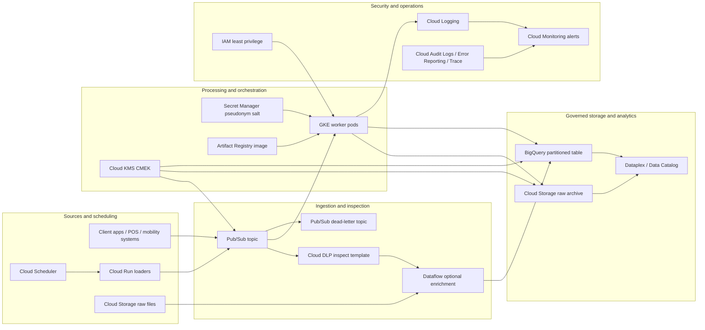

# GCP End-to-End Data Engineering for EY Use Cases

This repository demonstrates a production-style, end-to-end data engineering pattern on Google Cloud Platform (GCP) for EY-relevant analytics workloads. It combines Terraform-managed cloud infrastructure, Pub/Sub ingestion, a Python worker on Google Kubernetes Engine (GKE), BigQuery storage, and governance controls such as pseudonymisation, retention, logging, and least-privilege IAM.

## Why this matters for EY

EY teams commonly help clients modernise data platforms while preserving auditability, privacy, and operational resilience. This project applies the architecture to practical use cases that can be demonstrated with public real-world datasets and adapted to client data later:

| Use case | Public data source | EY business outcome |
| --- | --- | --- |
| **Mobility expense assurance** | NYC Taxi & Limousine Commission trip records | Detect unusual fares, route-cost outliers, and policy exceptions in employee travel or mobility spend. |
| **ESG transport emissions reporting** | NYC TLC trip distance and vehicle-service metadata | Estimate trip-level CO2e and aggregate emissions for sustainability reporting. |
| **Retail transaction privacy pipeline** | Retail/POS-style JSON events | Ingest customer transactions while applying GDPR-aligned minimisation and pseudonymisation. |

See [`docs/use_cases.md`](docs/use_cases.md) for detailed use-case definitions, event contracts, and BigQuery analytics examples.

## Architecture




The solution now uses a broader GCP service map for production demos: Cloud Storage for raw landing and audit archive, Cloud DLP for sensitive-data inspection, Pub/Sub for streaming ingestion, Dataflow as an optional managed streaming enrichment tier, GKE for the Python worker, BigQuery for governed analytics, Dataplex/Data Catalog for discovery and governance, Cloud Composer and Cloud Scheduler for orchestration, Cloud KMS and Secret Manager for security, Artifact Registry for images, and Cloud Logging, Monitoring, Trace, Error Reporting, and Audit Logs for observability.

The solution implements this flow:

1. Cloud Scheduler, Cloud Run loaders, client applications, or batch uploads publish JSON events to Pub/Sub and optionally land raw files in Cloud Storage.
2. Cloud DLP can inspect payloads before curation, and Dataflow can be enabled for high-volume streaming enrichment when managed autoscaling is preferred.
3. A Python microservice running on GKE consumes messages from the subscription, validates and normalises records, hashes identifiers with SHA-256, drops non-required fields, and adds processing metadata.
4. Raw messages can be archived to Cloud Storage, while cleansed records are written to partitioned BigQuery tables.
5. Dataplex/Data Catalog document the data estate, and Cloud Logging, Monitoring, Trace, Error Reporting, and Audit Logs provide accountability and operational health.

Detailed architecture notes are in [`docs/architecture.md`](docs/architecture.md).

## Repository layout

```text
.
├── data_pipeline.py              # Pub/Sub -> transformation -> BigQuery worker
├── deployment.yaml               # Kubernetes deployment for GKE
├── Dockerfile                    # Container image definition
├── main.tf                       # Terraform infrastructure definition
├── requirements.txt              # Python runtime dependencies
├── sample_events/                # Real-data-shaped demo events
├── tests/                        # Unit tests for transformations
└── docs/
    ├── architecture.md
    └── use_cases.md
```

## Local development

Create a virtual environment and install dependencies:

```bash
python -m venv .venv
source .venv/bin/activate
pip install -r requirements.txt
```

Run unit tests:

```bash
python -m pytest
```

Transform a local sample event without connecting to GCP:

```bash
python data_pipeline.py --local-sample sample_events/nyc_taxi_trip.json
```

## Deployment overview

1. Build and push the container image:

   ```bash
   docker build -t gcr.io/$PROJECT_ID/ey-gcp-data-pipeline:latest .
   docker push gcr.io/$PROJECT_ID/ey-gcp-data-pipeline:latest
   ```

2. Provision infrastructure:

   ```bash
   terraform init
   terraform apply -var="project_id=$PROJECT_ID" -var="region=europe-west2"
   ```

3. Deploy the worker to GKE:

   ```bash
   kubectl apply -f deployment.yaml
   ```

4. Publish a sample message:

   ```bash
   gcloud pubsub topics publish ey-transaction-events \
     --message="$(cat sample_events/nyc_taxi_trip.json)"
   ```

## Configuration

The worker reads configuration from environment variables:

| Variable | Description | Default |
| --- | --- | --- |
| `GCP_PROJECT` | GCP project ID | Required for cloud mode |
| `PUBSUB_SUBSCRIPTION` | Pub/Sub subscription name or full path | Required for cloud mode |
| `BQ_DATASET` | BigQuery dataset | `ey_data_engineering` |
| `BQ_TABLE` | BigQuery destination table | `processed_events` |
| `PSEUDONYM_SALT` | Secret salt used before SHA-256 hashing | Empty string for local demo only |
| `RAW_ARCHIVE_BUCKET` | Optional Cloud Storage bucket for encrypted raw-message audit archive | Disabled |

In production, inject `PSEUDONYM_SALT` from Secret Manager rather than storing it in code or Kubernetes manifests.

## Compliance design

* **Data minimisation:** Transformation code only persists analytics-required fields.
* **Pseudonymisation:** Direct identifiers are salted and hashed before BigQuery storage.
* **Retention:** Terraform configures partition expiration on BigQuery tables.
* **Least privilege:** Workload identity is designed around Pub/Sub subscriber and BigQuery data editor roles only.
* **Accountability:** Structured logs capture event type, processing status, and error context without logging raw personal data.

### Architecture diagram notes

The README architecture is rendered as Mermaid text so the repository remains source-only and avoids unsupported binary image files. The diagram represents the major GCP service layers used by this repository: sources and schedulers, ingestion and inspection, transformation and orchestration, governed storage and analytics, and security/operations services.
